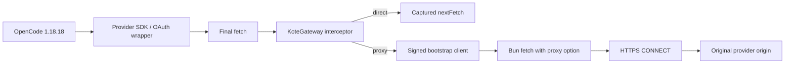
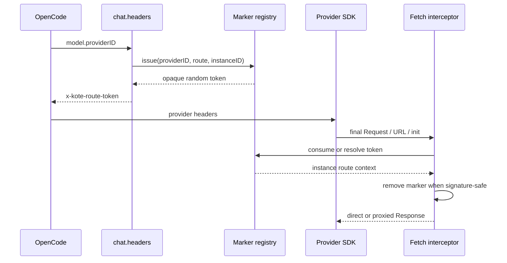

# Architecture

The package separates reusable KoteGateway policy/protocol code from the OpenCode adapter.



`src/core` has no OpenCode dependency. It owns configuration, route resolution, bootstrap verification/cache, typed errors, and sanitized diagnostics. `src/opencode` owns hooks, route markers, global fetch composition, transport guards, instance lifetime, and the OpenCode 1.18.18 compatibility behavior.

## Provider correlation

URLs are insufficient for routing because two provider IDs may share a base URL while requiring different routes. A process-global `currentProvider` is also unsafe when sessions overlap. Correlation is instead carried by a short-lived opaque marker.



The marker contains no readable provider ID or session data. The registry stores context in memory with an expiry and bounded capacity. Each marker includes instance ownership so parallel projects and identical URLs cannot mix routes.

For signature schemes such as AWS SigV4, removing a header after signing can invalidate the request. If the marker is named in the signed-header set, the interceptor preserves the opaque marker. This may expose a random correlation value to the provider, but it does not expose the provider ID and avoids corrupting the signature.

## Fetch composition

On the first instance, the adapter records the current `globalThis.fetch` as `nextFetch` and installs one wrapper under versioned state stored with `Symbol.for`. Later plugin instances share the wrapper and register their own configuration/client.

Both routes call the captured `nextFetch`:

```text
wrapper already present when KoteGateway loads
  -> captured as nextFetch
  -> KoteGateway wrapper
  -> wrapper installed later (if any)
```

The KoteGateway wrapper never calls `globalThis.fetch` recursively. Bootstrap requests use the captured transport directly and therefore never enter the wrapper.

Disposal decrements the instance reference count. The original fetch is restored only when no instances remain and `globalThis.fetch` is still the KoteGateway wrapper. A wrapper installed later is never overwritten during disposal.

## Request handling

The interceptor accepts string, `URL`, and `Request` inputs plus an overriding `RequestInit`. It clones headers instead of mutating caller-owned objects, preserves body streams and abort signals, and returns the original streaming `Response` without buffering.

Routing order is:

1. normalize the URL and effective headers;
2. resolve a present opaque marker and its owning plugin instance;
3. for an unmarked request, bypass the exact local OpenCode server origin;
4. compare an exact auxiliary-origin candidate with any observed provider routes and block ambiguous route conflicts;
5. leave unrelated traffic unmodified;
6. remove the marker unless it participates in the request signature, and remove the OpenAI HTTP-fallback header only when KoteGateway added it;
7. call `nextFetch` directly, or resolve the gateway and add Bun's per-request proxy option;
8. propagate errors without a direct retry.

Only the origin is used for auxiliary matching. Paths, queries, credentials, and fragments are forbidden in configuration. The bootstrap origin is excluded to prevent recursion.

## Bootstrap and cache

The client lazily resolves bootstrap on the first proxy request. Concurrent callers share one in-flight promise. A verified fresh remote document becomes the last-known-good cache; bad remote data cannot replace it. A signed cache remains usable through the original seven-day emergency grace window.

There is no hidden gateway address and no direct fallback. The legacy protocol makes one hardened remote attempt, then checks the verified cache. The signed v1 document supplies only an HTTPS proxy origin; it does not supply code or proxy credentials.

## OAuth placement

The interceptor runs after the provider's fetch wrapper when that wrapper calls the patched global fetch:

```text
OpenCode credential store
  -> refresh if needed
  -> provider-specific headers/signature
  -> provider URL rewrite
  -> KoteGateway fetch interceptor
  -> direct or CONNECT proxy
```

This preserves OpenCode's authorization ownership. Auxiliary origins route unmarked in-process token exchange and refresh calls. External browser navigation is out of process and therefore outside the interceptor.

## Fail-closed boundary

After successful initialization, a marked `proxy` request cannot retry direct. Invalid configuration is retained as blocked state, and missing/expired markers or unsupported transports produce typed errors under the adapter's fail-closed policy. Local configuration `strict` only controls unknown top-level fields.

The boundary is fetch-based. The public API cannot intercept arbitrary sockets, prevent OpenCode from continuing when the package itself failed to load, or recover provider identity after a wrapper removes the marker and rewrites to another configured auxiliary origin. Those cases require a compatible transport contract or external egress controls; they are not represented as solved by this architecture.
